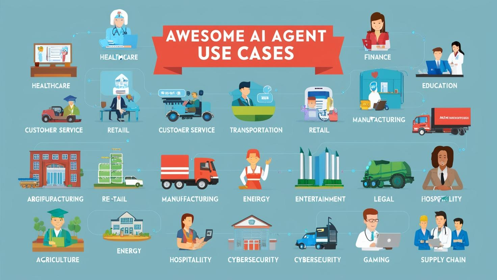

<!-- Profile Banner -->

  

<h1 align="center">👋 Hi, I'm a Professional Developer based in Zürich, Switzerland</h1>

---

### 🔭 Currently Planning My Next Projects
📫 How to reach me: **+41 44 589 7012**

---

## 🏆 Key Achievements
- Led a team of 10 in the **AutoCarE Street Sweeper Project**, advancing SLAM, motion planning, and navigation.
- Designed and integrated motion planning & perception in autonomous vehicles; managed **live test drives**.
- Built **embedded/adaptive AUTOSAR software** with fail-safe and **Kubernetes-based real-time architectures**.
- Taught **Applied Mechanics** to 100+ students, enhancing communication and mentoring skills.

---

## 🧠 Skills & Expertise
**Core Skills**
> Continuous Integration/Deployment (CI/CD), Docker, Kubernetes, Terraform, Ansible, CloudFormation,  
> AWS, Azure, Google Cloud Platform (GCP), Linux/Unix Administration, Scripting (Python, Bash, Shell, PowerShell),  
> Git, Jenkins, GitLab CI, Bamboo, Prometheus, Grafana, ELK Stack, Datadog, Chef, Puppet, SaltStack,  
> Microservices & API Management, Networking, Security, Agile, Scrum, Automated Testing, and Cloud-Native Development.

---

## 💻 Languages and Tools

  

---

## 📚 Papers and Talks
- **Artificial Intelligence (2022):** Optimization of a Semi-Supervised Deep Learning Object Detection Algorithm  
- **GenAI Zürich 2024:** Connecting GenAI with Existing Systems  
- **GenAI Zürich 2025:** AI Developer Workshop  

---

## 🧾 Certifications
- **Secure and Responsible Gen AI with GuardRails**

---

## 🧩 References
**Eric** → [Video Reference](https://example.video.com/)

---

## 🖼️ AI Agent Use Case

  

---

  

---

⭐ **Thanks for visiting my profile!**  
I’m open to collaborations, research projects, and innovative AI-driven ideas.

